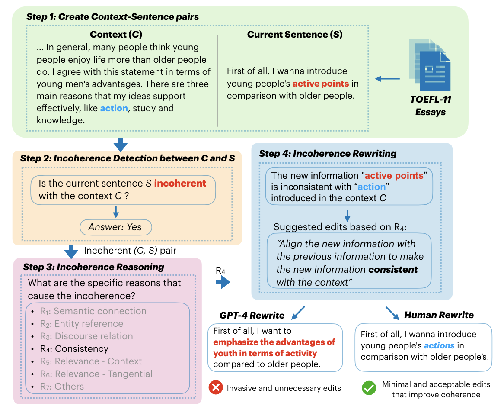

# 📔 DECOR: Improving Coherence in L2 English Writing with a Novel Benchmark for Incoherence Detection, Reasoning, and Rewriting

This is the repository for DECOR, a novel benchmark that includes expert annotations for detecting incoherence in L2 English writing, identifying the underlying reasons, and rewriting the incoherent sentences. 

The figure above shows an example data point in DECOR, containing input context-sentence pairs, binary detection label, reason types for incoherence, and human rewrites.

In general, this repository offers:

1. The data format (CSV) for DECOR 📔
2. A supervised fine-tuning pipeline with task-specfic synthetic data
3. A standardized evaluation pipeline for all three tasks

## News
- [2024/06] 🔥 We release the preprint of DECOR. Read our [paper](https://arxiv.org/abs/2406.19650) for more details!

## Table of Contents
- [Downloading the DECOR benchmark](#downloading-the-decor-benchmark)
- [Environment settings](#environment-settings)
- [Supervised Fine-tuning pipelines](#supervised-fine-tuning-pipelines)
- [Evaluating on DECOR](#evaluating-on-decor)
- [Citation](#citation)
- [Questions](#questions)

## Downloading the DECOR benchmark 📔
We release the dev and test data for each task in DECOR 📔. They can be downloaded from the following links in the table:

<table><thead>
  <tr>
    <th rowspan="2" style="text-align: center;"> Incoherence  Detection</th>
    <th colspan="4" style="text-align: center;">Incoherence reasoning</th>
    <th rowspan="2" style="text-align: center;"> Incoherence Rewriting</th>
  </tr>
  <tr>
    <th style="text-align: center;">Cohesion</th>
    <th style="text-align: center;">Consistency</th>
    <th style="text-align: center;">Relevance</th>
    <th style="text-align: center;">Other</th>
  </tr></thead>
<tbody>
  <tr>
    <td><a href="https://github.com/BillyZhang24kobe/writing2coherence/blob/main/data/dev/binary_dev.csv">dev set</a>
    </td>
    <td><a href="https://github.com/BillyZhang24kobe/writing2coherence/blob/main/data/dev/cohesion_dev.csv">dev set</a>
    </td>
    <td>
    <a href="https://github.com/BillyZhang24kobe/writing2coherence/blob/main/data/dev/consistency_dev.csv">dev set</a></td>
    <td>
    <a href="https://github.com/BillyZhang24kobe/writing2coherence/blob/main/data/dev/relevance_dev.csv">dev set</a></td>
    <td>
    <a href="https://github.com/BillyZhang24kobe/writing2coherence/blob/main/data/dev/other_dev.csv">dev set</a></td>
    <td>
    <a href="https://github.com/BillyZhang24kobe/writing2coherence/blob/main/data/dev/rewrite_541.csv">dev set</a></td>
  </tr>
  <tr>
    <td><a href="https://github.com/BillyZhang24kobe/writing2coherence/blob/main/data/test/test_1355_clean.csv">test set</a></td>
    <td>
    <a href="https://github.com/BillyZhang24kobe/writing2coherence/blob/main/data/test/cohesion_test.csv">test set</a></td>
    <td>
    <a href="https://github.com/BillyZhang24kobe/writing2coherence/blob/main/data/test/consistency_test.csv">test set</a></td>
    <td>
    <a href="https://github.com/BillyZhang24kobe/writing2coherence/blob/main/data/test/relevance_test.csv">test set</a></td>
    <td>
    <a href="https://github.com/BillyZhang24kobe/writing2coherence/blob/main/data/test/other_test.csv">test set</a></td>
    <td><a href="https://github.com/BillyZhang24kobe/writing2coherence/blob/main/data/test/test_rewrite_213_no_delete.csv">test set</a></td>
  </tr>
</tbody>
</table>

### DECOR data format

To construct DECOR, we start by creating context-sentence pairs from the essays sampled from [TOEFL-11 corpus](https://www.ets.org/research/policy_research_reports/publications/report/2013/jrkv.html). Each data point of DECOR consists of the following columns:

- `essay_id`: the id of the original essay from TOEFL-11 dataset.
- `topic`: the topic prompt as plain text for the sampled essay. Note that in total there are 8 prompts from the dataset.
- `context`: the context sentences as plain text, which comprises all preceding sentences up to and immediately before the current sentence in the essay.
- `sentence`: the current sentence as plain text
- `label`: a binary label (1 or 0) indicating (a) if the current sentence is incoherent with the context for the task of incoherence detection, or (b) if the incoherence is caused by any of the reasons (i.e. cohesion, consistency, relevance, and other) for the task of incoherence reasoning.
- `R1`: a binary label (1 or 0) indicating if the incoherence is caused by _semantic connection_.
- `R2`: a binary label (1 or 0) indicating if the incherence is caused by _entity reference_.
- `R3`: a binary label (1 or 0) indicating if the incherence is caused by _discourse relation_.
- `R4`: a binary label (1 or 0) indicating if the incherence is caused by _consistency_.
- `R5`: a binary label (1 or 0) indicating if the incherence is caused by _contextual relevance_.
- `R6`: a binary label (1 or 0) indicating if the incherence is caused by _tangential relevance_.
- `R7`: a binary label (1 or 0) indicating if the incherence is caused by _other_ reasons that are not specified above.
- `Rewrite`: The rewrite of the incoherent sentence so that it is now coherent with the context.

Note that for coherent context-sentence pairs, the reason types and rewrites are marked empty.